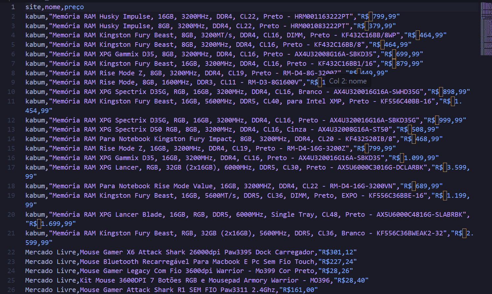

# Multi-Site Price Scraper

This project was built based on a fictional client request: extract product names and prices from multiple e-commerce websites and consolidate everything into a single CSV file.

## Structure

```
project/
│
├── scrapers/
│   ├── kabum.py          # Scraper for KaBuM (hardware category)
│   └── mercado_livre.py  # Scraper for Mercado Livre (mouse gamer category)
│
├── main.py               # Runs all scrapers and exports to CSV
└── produtos.csv          # Output file
```

- Each scraper is an independent module that returns a list of dicts with the extracted data.
- `main.py` imports all modules, merges the results, and saves them to a CSV file.

## Example Output



CSV spreadsheet displaying scraped product data from KaBuM and Mercado Livre websites, with three columns showing retailer names, product descriptions for computer hardware and gaming peripherals, and prices in Brazilian Real currency.

## How to run

1. Install dependencies:
```bash
pip install playwright pandas
playwright install chromium
```

2. Run:
```bash
python main.py
```

A `produtos.csv` file will be generated with all collected data.

## Notes

This project has no interface, since the original request was simple — run manually and return raw data in a CSV. In a production scenario, the ideal would be to add at minimum a way to pass custom category URLs as input, so the client can monitor any product page without touching the code.

## Built with

- Python
- Playwright
- csv
